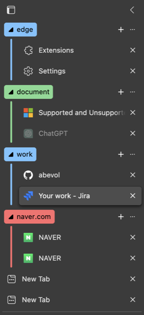

# Smart Grouping Tags

This project forked from [AutoGroupTabs](https://github.com/abevol/AutoGroupTabs) by [abevol](https://github.com/abevol).

Simple and easy to use extension for automatically grouping tags with rules based

## Features

1. Automatically group tags into different tag groups based on rules.
2. Once installed, it will automatically group existing tabs.
3. Whenever a new tab is opened, it will be automatically grouped.

## Demonstration




## Config

Default rules are following.

```
{
  "groupingDefault": false,
  "rules": [
    {
      "name": "work",
      "hosts": [
        "*.github.com",
        "*.atlassian.net"
      ]
    },
    {
      "name": "document",
      "hosts": [
        "*.openai.com",
        "*.learn.microsoft.com"
      ]
    },
    {
      "name": "ask",
      "hosts": [
        "*.openai.com"
      ]
    }
  ]
}
```

- `groupingDefault`
  - If true, all tabs will be grouped by rules and if the rules not found then it will group by hostname.
  - If false, all tabs will be grouped by rules but do not group if no matching rules found.
- `rules`
  - `name`: Name of the group displayed in the tab name
  - `hosts`: Hostname of the tab to be grouped.
